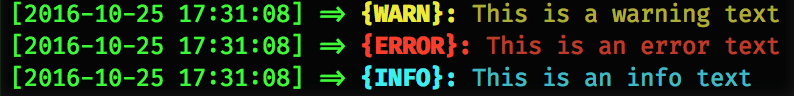
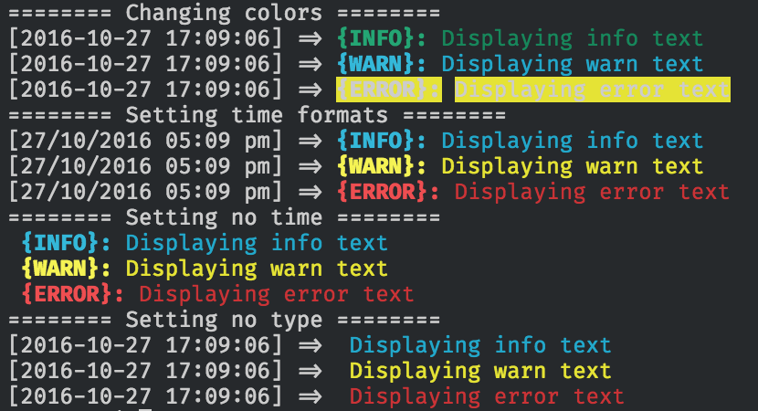

# Knoblr

 
[](https://codecov.io/gh/khaosdoctor/knoblr)
[](https://travis-ci.org/khaosdoctor/knoblr) 
[](https://www.codacy.com/app/khaosdoctor/knoblr?utm_source=github.com&amp;utm_medium=referral&amp;utm_content=khaosdoctor/knoblr&amp;utm_campaign=Badge_Grade)

> Knoblr is a simple logging library to help node developers.

<!-- TOC -->

- [Knoblr](#knoblr)
  - [What is](#what-is)
  - [Installing](#installing)
  - [Using](#using)
    - [API](#api)
  - [Customizing usage](#customizing-usage)
    - [Datetime formats](#datetime-formats)
    - [Displaying the timestamp](#displaying-the-timestamp)
    - [Displaying log type](#displaying-log-type)
    - [Log colors](#log-colors)
    - [Reset](#reset)

<!-- /TOC -->

## What is

It basically adds a funcionality of displaying three types of logs:

- Warns
- Errors
- Info

Very simple. And it comes along with a timestamp, and color codes!

## Installing

Just perform a `npm install --save knoblr`

## Using

In your file require the logger:

```js
const log = require('knoblr');
```

Then you can use like this:

```js
const log = require('knoblr');

log.warn('This is a warn text');
log.error('This is an error text');
log.info('This is an info text');
```

This will be the output:



### API

There's also an API to help developers get their error messages straight and format them as they please. All you need to do is set a second parameter to `true`:

```js
const log = require('knoblr');

var warnString = log.warn('This is a warn text', true); //this will return a string instead
var errorString = log.error('This is an error text', true); //this will return a string instead
var infoString = log.info('This is an info text', true); //this will return a string instead
```

## Customizing usage

There are options to customize the output of the log, such as:

- Datetime formats
- Whether or not to display the timestamp
- Displaying log type
- Logging colors

### Datetime formats

Knoblr uses [Moment.js](http://momentjs.com/) to issue times and formats, so all the Moment's formats will be compatible with Knoblr.

> Refer to [this url](http://momentjs.com/docs/#/displaying/) to know more about formats.

In order to set the time formats you can do:

```js
const log = require('knoblr');

log.setTimeFormat("Your format Here");

log.warn('This is a warn text with your timestamp');
log.error('This is an error text with your timestamp');
log.info('This is an info text with your timestamp');
```

The default time format is `YYYY-MM-DD HH:mm:ss` (In other words its `<4-digit year>/<2-digit month>/<2-digit-day> <24h hours>:<2-digit minutes>:<2-digit seconds>`).

### Displaying the timestamp

You have the choice not to display the timestamp along with the log, just set:

```js
const log = require('knoblr');

log.displayTimestamp = false;

log.warn('This is a warn text without the timestamp');
log.error('This is an error text without the timestamp');
log.info('This is an info text without the timestamp');
```

### Displaying log type

Same as before, you can choose not to show `{WARN}`, `{INFO}` and `{ERROR}` texts during logs, for that to happen all you have to do is:

```js
const log = require('knoblr');

log.displayLogType = false;

log.warn('This is a warn text without the log type');
log.error('This is an error text without the log type');
log.info('This is an info text without the log type');
```

### Log colors

Knoblr uses [Chalk](https://github.com/chalk/chalk) as colorizer, so you can set an instance of chalk using Knoblr return implementation object.

Knoblr exposes chalk as an instance so the you don't need to require it:

```js
const log = require("../dist/log.js");
log.setLogColor('info', log.colors.green);
log.setLogColor('warn', log.colors.cyan);
log.setLogColor('error', log.colors.bgYellow);

log.warn('This will be cyan');
log.error('This will have an awesome yellow bg');
log.info('This will be green');
```

### Reset

If you want to switch back to the original values just perform a `log.reset()`.

> Check the [basetest file](tests/base.js) to get a glimpse of all commands.

This will be the output of the tests:



# License

MIT @ [Lucas Santos](http://lsantos.me)

> Please note that this project is released with a [Contributor Code of Conduct](code-of-conduct.md). By participating in this project you agree to abide by its terms.
